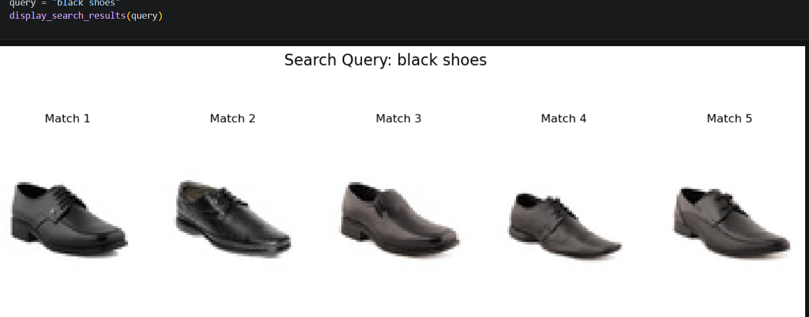

# AI Product Intelligence System

## Overview

AI Product Intelligence System is an AI-powered product search and recommendation platform that leverages multimodal learning to understand product images and retrieve visually similar products. The project combines OpenCLIP embeddings with FAISS similarity search to enable intelligent product retrieval, duplicate detection, and AI-generated product insights.

This project was developed using Python, PyTorch, OpenCLIP, and FAISS in a Jupyter Notebook environment.

---

## Features

- Reverse Product Search using image embeddings
- AI-powered Product Insights
- Intelligent Product Recommendations
- Duplicate Product Detection
- Semantic Image Retrieval
- Fast Similarity Search using FAISS
- Product Image Visualization

---

## Technologies Used

**Programming Language**
- Python

**Libraries & Frameworks**
- PyTorch
- OpenCLIP
- FAISS
- NumPy
- Matplotlib
- Pillow (PIL)

**Development Environment**
- Jupyter Notebook

---

## Project Structure

```text
GenAI_Product_Intelligence/
│
├── Product_Intelligence.ipynb
├── README.md
├── requirements.txt
├── .gitignore
├── REPORT.docx
├── embeddings.npy
├── dataset/
└── screenshots/
    ├── task1 pic.png
    ├── task2 pic.png
    ├── shoes.png
    └── watch query.png
```

---

## Workflow

1. Load the product dataset.
2. Generate image embeddings using OpenCLIP.
3. Store embeddings in a FAISS index.
4. Accept a product image or query.
5. Retrieve visually similar products.
6. Generate AI-powered product insights.
7. Recommend similar products.

---

## Results

- Generated semantic image embeddings using OpenCLIP.
- Implemented efficient similarity search with FAISS.
- Developed a reverse product search engine.
- Generated AI-based product insights.
- Retrieved visually similar product recommendations.
- Improved product discovery using multimodal AI.

---

## Applications

- E-commerce Product Search
- Product Recommendation Systems
- Visual Search
- Duplicate Product Detection
- AI-powered Retail Solutions
- Fashion Product Discovery

---

## Screenshots

### Task 1


### Task 2


### Shoes Query



### Watch Query


---

## Future Improvements

- Develop a Streamlit web application.
- Support text-to-image product search.
- Integrate real-time product databases.
- Fine-tune the embedding model for improved accuracy.
- Deploy the project as a web application.

---

## Author

**A. Yasaswee Reddy**

B.Tech – Computer Science and Engineering (Artificial Intelligence & Machine Learning)

GitHub: https://github.com/alumoluyasasweereddy-a

LinkedIn: https://www.linkedin.com/in/yasaswee-reddy-alumolu-580929346